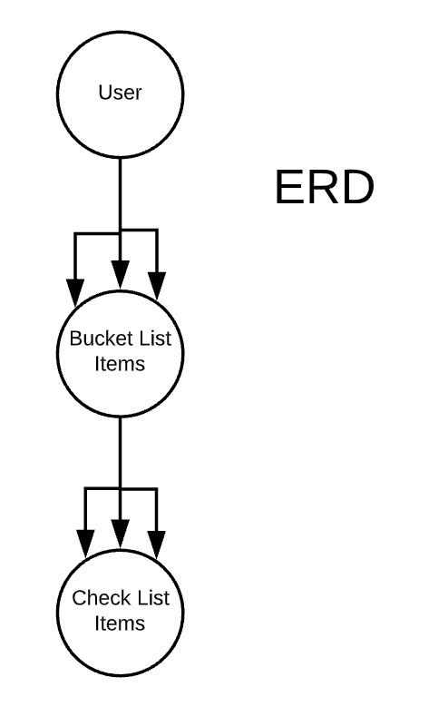
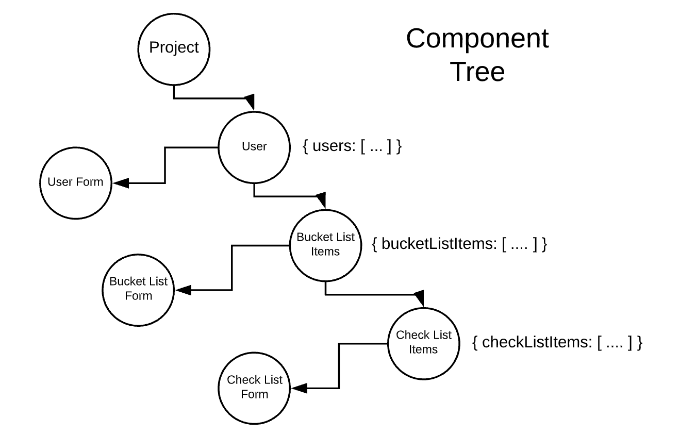
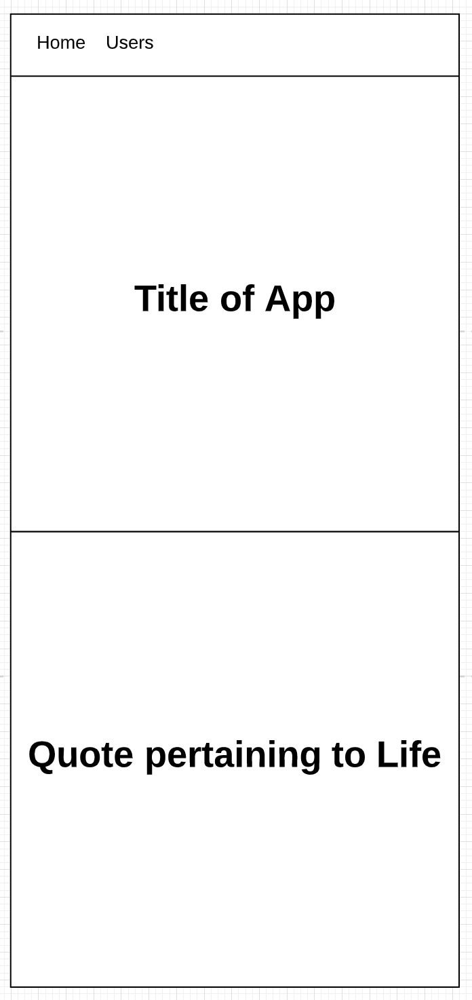
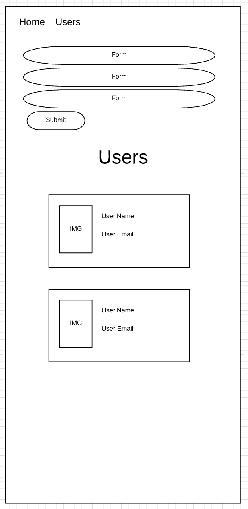
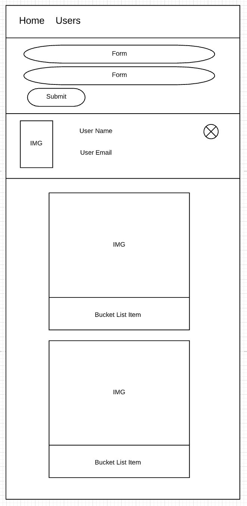
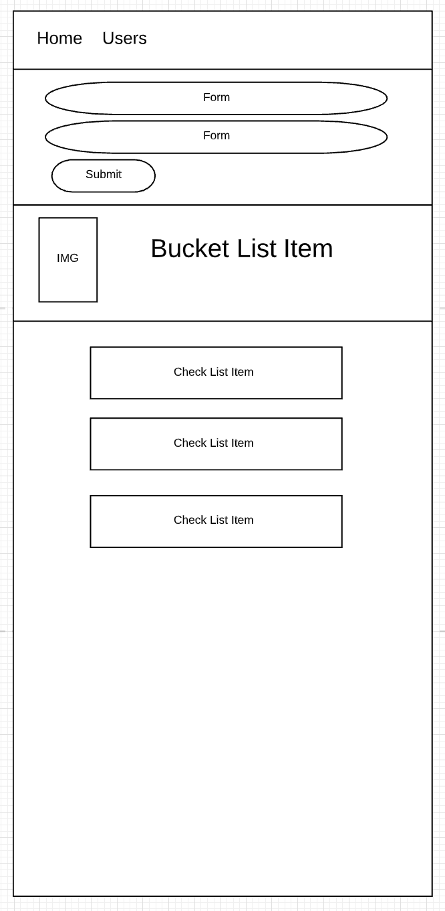

# Sei23-Project4
## Moments for Life

Moments for Life is a mobile Bucket List app. Each user can create an individual profile and add items they wish to complete. Within each Bucket List Item is a checklist for what is needed to complete the Bucket List Item.

[**Deployed Site**](https://fathomless-fortress-40837.herokuapp.com)

[**Project Board**](https://github.com/shawn-e-harris/project4.git)

## Technologies Used:
* React
* Django
* SQLite
* Node.js
* HTML
* CSS

## V2 Goals:
* Search functionality by User
* Update Status of completion
* Delete optioon for Bucket List Items and Check List Items

## ERD

## Component Tree

## Wireframes

